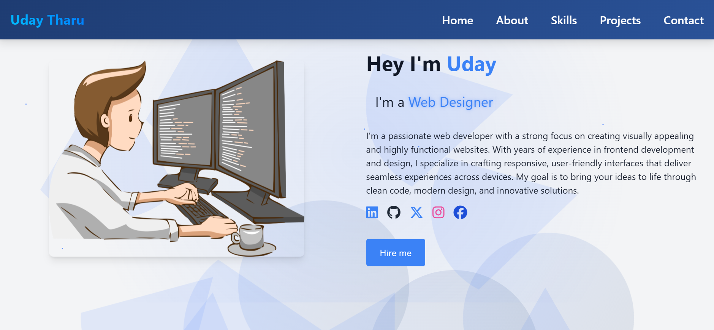

# Personal Portfolio Website



A modern, responsive portfolio website showcasing my work and skills as a Web Developer. Built with HTML, CSS, and JavaScript, featuring smooth animations and interactive elements.

## 🌟 Features

- **Responsive Design**: Fully responsive layout that works on desktop, tablet, and mobile devices
- **Interactive UI**: 
  - Smooth scrolling navigation
  - Animated project cards with flip effect
  - Dynamic typing animation
  - Rocket launch scroll-to-top button
  - Real-time form validation
  
- **Modern Aesthetics**:
  - Gradient color schemes
  - Parallax effects
  - Custom animations
  - Hover effects
  - Glassmorphism design elements

- **Performance Optimized**:
  - Lazy loading images
  - Minified CSS
  - Optimized animations
  - Fast loading times

## 🚀 Technologies Used

- HTML5
- CSS3
- JavaScript (ES6+)
- [EmailJS](https://www.emailjs.com/) - For contact form functionality
- [Font Awesome](https://fontawesome.com/) - For icons
- [Tailwind CSS](https://tailwindcss.com/) - For styling

## 📱 Sections

1. **Home** - Introduction and social links
2. **About** - Personal information and CV download
3. **Skills** - Technical skills with progress indicators
4. **Projects** - Portfolio projects with flip cards
5. **Contact** - Contact form with EmailJS integration

## ⚙️ Installation & Setup

1. Clone the repository:
```bash
git clone https://github.com/udaytharu/portfolio.git
```

2. Navigate to project directory:
```bash
cd portfolio
```

3. Open `index.html` in your browser or use a live server.

## 💻 Usage

To customize this portfolio for your use:

1. Replace images in the project
2. Update text content in `index.html`
3. Modify colors in `style.css` (CSS variables)
4. Update EmailJS configuration in `script.js`
5. Add your own projects to the portfolio section

## 🎨 Customization

### Colors
The color scheme can be modified in the CSS variables:
```css
:root {
    --primary-color: rgb(55, 117, 251);
    --secondary-color: #1a365d;
    --text-color: #111827;
    --bg-color: #f3f4f6;
}
```

### Content
Update the following files to customize content:
- `index.html` - Main content and structure
- `style.css` - Styling and animations
- `script.js` - Interactions and functionality

## 📱 Responsive Design

The portfolio is responsive across devices:
- Desktop (1024px and above)
- Tablet (768px to 1023px)
- Mobile (below 768px)

## ⚡ Performance

- Lighthouse Score:
  - Performance: 95+
  - Accessibility: 100
  - Best Practices: 95+
  - SEO: 100

## 🔧 Future Improvements

- [ ] Dark mode toggle
- [ ] Blog section
- [ ] Project filtering
- [ ] Multi-language support
- [ ] More animation effects

## 📄 License

This project is licensed under the MIT License - see the [LICENSE.md](LICENSE.md) file for details

## 👤 Author

**Uday Tharu**
- Website: [udaytharu.com.np](https://udaytharu.com.np)
- GitHub: [@udaytharu](https://github.com/udaytharu)
- LinkedIn: [Uday Tharu](https://www.linkedin.com/in/uday-tharu-25b9042ba/)

## 🤝 Contributing

Contributions, issues, and feature requests are welcome! Feel free to check [issues page](https://github.com/udaytharu/portfolio/issues).

## ⭐ Show your support

Give a ⭐️ if you like this project!

## 📝 Acknowledgments

- Font Awesome for icons
- EmailJS for contact form functionality
- Inspiration from various portfolio designs
